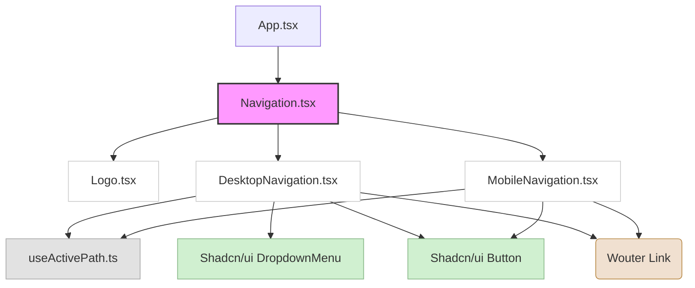

# Navigation Component API Design and Refactor Plan

## 1. Goal

This document defines the API contracts for `DesktopNavigation` and `MobileNavigation` components, clarifies their responsibilities, specifies breakpoint usage, formalizes the active-link strategy, and outlines the plan for a clean separation from the parent `Navigation.tsx` component.

## 2. Current State Analysis

The current implementation already features a separation where `client/src/components/Navigation.tsx` acts as a container, importing and rendering `DesktopNavigation` and `MobileNavigation`. It also defines and passes the `navItems` data.

*   [`client/src/components/Navigation.tsx`](client/src/components/Navigation.tsx): Defines `navItems` and renders `DesktopNavigation` and `MobileNavigation`. Contains the fixed positioning and overall wrapper.
*   [`client/src/components/navigation/DesktopNavigation.tsx`](client/src/components/navigation/DesktopNavigation.tsx): Renders desktop-specific navigation, including dropdowns using Shadcn/ui's `DropdownMenu`. Uses `useActivePath` and hides itself on `md` breakpoint and below.
*   [`client/src/components/navigation/MobileNavigation.tsx`](client/src/components/navigation/MobileNavigation.tsx): Renders mobile-specific navigation with a toggle. Uses `useActivePath` and hides itself on `md` breakpoint and above.
*   [`client/src/components/navigation/useActivePath.ts`](client/src/components/navigation/useActivePath.ts): A custom hook utilizing `wouter`'s `useLocation` to determine if a given `href` is the active path.

## 3. Component Contracts (API Design)

The existing structure is largely aligned with the refactor goal. The primary task is to formalize the contracts and ensure full adherence to the chosen breakpoint and active-link strategy.

### Shared `NavItem` Type

The `NavItem` and `NavChild` types are already defined in both `DesktopNavigation.tsx` and `MobileNavigation.tsx`. This should be centralized to a shared `types.ts` file within the `client/src/components/navigation/` directory to avoid duplication.

```typescript
// client/src/components/navigation/types.ts
export type NavChild = { label: string; href: string };
export type NavItem = { label: string; href?: string; children?: NavChild[] };
```

### `DesktopNavigation` API

**File:** [`client/src/components/navigation/DesktopNavigation.tsx`](client/src/components/navigation/DesktopNavigation.tsx)

```typescript
interface DesktopNavigationProps {
  navItems: NavItem[]; // Array of navigation items
}

function DesktopNavigation({ navItems }: DesktopNavigationProps) {
  // ... (implementation using navItems, Link from wouter, etc.)
  // Responsibilities:
  // - Render desktop navigation links.
  // - Handle dropdown menus for items with children.
  // - Apply active link styling based on `useActivePath` Hook.
  // - Render the CTA button.
  // - Be hidden on screens smaller than the 'md' breakpoint.
}
```

### `MobileNavigation` API

**File:** [`client/src/components/navigation/MobileNavigation.tsx`](client/src/components/navigation/MobileNavigation.tsx)

```typescript
interface MobileNavigationProps {
  navItems: NavItem[]; // Array of navigation items
}

function MobileNavigation({ navItems }: MobileNavigationProps) {
  // ... (implementation for mobile menu toggle, drawer, etc.)
  // Responsibilities:
  // - Render a mobile menu toggle (hamburger/X icon).
  // - Manage mobile menu open/close state.
  // - Render navigation links suitable for mobile (e.g., stacked list).
  // - Apply active link styling based on `useActivePath` Hook.
  // - Handle closing the menu on link click.
  // - Be hidden on screens larger than or equal to the 'md' breakpoint.
}
```

### `useActivePath` Hook API

**File:** [`client/src/components/navigation/useActivePath.ts`](client/src/components/navigation/useActivePath.ts)

This hook's API is already well-defined and functional.

```typescript
import { useLocation } from "wouter";

export function useActivePath() {
  const [path] = useLocation();

  const isActive = (href: string) => {
    if (!href) return false;
    if (href === "/") return path === "/";
    return path.startsWith(href);
  };

  return { path, isActive };
}
```

## 4. Breakpoints and Responsive Strategy

As per "Decision C" in Phase 0, the **Tailwind `md` breakpoint** will be used for the navigation split.

*   **DesktopNavigation:** Will be visible **`md:`** and above (`hidden` below `md`).
*   **MobileNavigation:** Will be visible **below `md:`** (`md:hidden`).

This is already correctly implemented in both components (`<div className="hidden md:flex ..."` in `DesktopNavigation` and `<div className="md:hidden">` in `MobileNavigation`).

## 5. Active-Link Strategy

The `useActivePath` hook correctly implements the active-link strategy:
*   Root path `/` matches only `/`.
*   Other paths `href` match if the current `path` starts with `href`.

This strategy is robust for nested routes (e.g., `/services/residential` is active when `/services` is clicked if `href='/services'`). The styling (e.g., `text-brand-black` for active, `text-brand-gray hover:text-brand-gold` for inactive) is handled directly within the components using conditional class names.

## 6. Planning Extraction from `client/src/components/Navigation.tsx`

The `Navigation.tsx` component is already quite lean and primarily responsible for:
1.  Defining the `navItems` data structure.
2.  Rendering the `Logo`.
3.  Providing the overall `<nav>` wrapper with fixed positioning and responsive padding.
4.  Delegating rendering to `DesktopNavigation` and `MobileNavigation`.

The main extraction would be to move the `navItems` array definition to a more appropriate place if it were to grow significantly or be sourced externally. For now, keeping it within `Navigation.tsx` is acceptable given its current size, or it could be moved to a `client/src/data/navigation.ts` file if a larger data separation strategy is adopted later.

### Summary of Extraction / Refinement for Code Phase:

*   **Centralize `NavItem` and `NavChild` types:** Move to a new file `client/src/components/navigation/types.ts`.
*   **Review `Navigation.tsx`:** Ensure it remains a simple orchestrator, mainly passing `navItems` to its children.
*   **Refine `DesktopNavigation` and `MobileNavigation`:** Ensure all styling is responsive and consistent with the new token system and Tailwind utilities where appropriate. Confirm no hardcoded colors/fonts remain outside of `styles/tokens.css` or Tailwind config.

### Mermaid Diagram for Component Structure



This plan formalizes the existing structure and sets up the "Code" phase for minor refinements and ensuring token adherence.